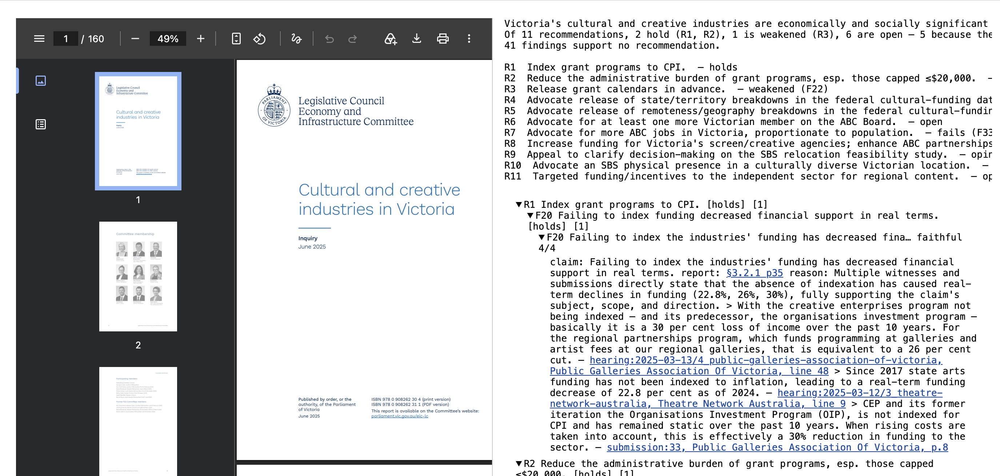

# elenchus

`assay` takes a report and the documents it draws on, breaks the report into atomic claims, checks
each claim against those sources, and propagates the checks up through the findings and
recommendations to the report's thesis. The output is a page you read.



The worked run is the Victorian LCEIC report on the cultural and creative industries:
[`examples/vic-lceic/current/review.html`](examples/vic-lceic/current/review.html). It is two panes.
The **left** shows the source document — the report itself, or the hearing transcript, submission, or
question-on-notice a quote comes from — as the original PDF. The **right** is assay's top-down
reading: the report's root proposition, the eleven recommendations under it each with a derived
verdict, each recommendation opening to the findings it rests on, and each finding opening to the
verbatim quotes that support it with their provenance. Click a report `§` or a quote on the right and
the left pane jumps to that page of that PDF.

The top of the right pane, verbatim from
[`argument.html`](examples/vic-lceic/current/argument.html):

```
Victoria's cultural and creative industries are economically and socially significant but under
strain, and the Victorian Government should act — and press the Federal Government and national
broadcasters — to rebuild, sustain and fairly fund them.

Of 11 recommendations, 2 hold (R1, R2), 1 is weakened (R3), 6 are open — 5 because the report
doesn't say what they rest on, 1 because their findings are contested — 1 fails (R7: no held source
supports F33), 1 is opinion (R9).
41 findings support no recommendation.

R1   Index grant programs to CPI.  — holds
R2   Reduce the administrative burden of grant programs, esp. those capped ≤$20,000.  — holds
R3   Release grant calendars in advance.  — weakened (F22)
R4   Advocate release of state/territory breakdowns in the federal cultural-funding dataset.  — open (F29 ?)
R5   Advocate release of remoteness/geography breakdowns in the federal cultural-funding dataset.  — open (F31 ?)
R6   Advocate for at least one more Victorian member on the ABC Board.  — open
R7   Advocate for more ABC jobs in Victoria, proportionate to population.  — fails (F33)
R8   Increase funding for Victoria's screen/creative agencies; enhance ABC partnerships.  — open (F39)
R9   Appeal to clarify decision-making on the SBS relocation feasibility study.  — opinion (F43)
R10  Advocate an SBS physical presence in a culturally diverse Victorian location.  — open
R11  Targeted funding/incentives to the independent sector for regional content.  — open (F51 ?)
```

## How to read the right pane

Every node — the root, each recommendation, each finding — carries a verdict. The six labels, from
`spec/ARGUMENT.md`:

- **holds** — every load-bearing child holds. The node stands on the ground its content claims.
- **weakened** — no child fails or opens, but some child is only partial, or wobbles between runs.
  The node still stands, but on narrower ground than its content claims.
- **open** — no load-bearing child fails, but the report never states what the node rests on (a `?`
  edge, or no finding attached), or a finding it rests on is contested. Not settled either way — the
  reader has to open it.
- **fails** — a load-bearing child fails: a supporting claim is contradicted, unsupported, or absent
  from the sources. One collapsed load-bearing premise collapses the node.
- **opinion** — the node is a pure value judgement. That is not evidence, so faithfulness cannot
  settle it and the tree does not pretend to.
- **contested** — a leaf where two identical runs land on different verdicts because the sources
  don't settle the claim either way.

**open** and **contested** are facts about the report, not about assay: **open** marks a place where
the report never says what its recommendation rests on, and **contested** marks a claim the sources
leave underdetermined — both describe the material, not the tool that read it.

## Where the judgements come from

Three sources, kept separate on purpose:

- The **report** supplies the propositions and the structure — each node's content, in the report's
  own words, and which findings a recommendation rests on.
- The **sources** supply the quotes — verbatim passages from the hearings, submissions, and
  questions-on-notice, each carrying the document, witness, and page it came from.
- The **code** derives every verdict. No judgement is written by hand; each is computed from the
  leaves up (`spec/ARGUMENT.md`). Writing a verdict into the tree is the one edit the format forbids
  — it would let the builder's opinion pass as a result.

Run the same corpus twice and about 20% of leaf verdicts move (of 60 judged findings: 48 settle, 3
wobble, 9 contested). The tool doesn't know whether that's the sources or the judge, so it reports
it: a leaf that moves is marked contested and sent to the reader.

## Run it on your own report

You supply four things:

- **claims** — the report's atomic claims, one file (`claims.txt`), plus `claims-machine.txt` mapping
  each claim to its report section.
- **argument** — the tree structure: root → recommendations → findings → claims, content only, no
  verdicts (`argument.txt`).
- **manifest** — `sources/MANIFEST.md`, mapping each source document's id to its file, witness, and
  locator.
- **sources** — the source documents themselves (`sources/hearings`, `sources/submissions`,
  `sources/qon`, `report.pdf`).

A faithfulness run (the model judge pass) produces the chain (`*.faithfulness.jsonl`) — this is
the model pass, roughly **$8 per run**. Everything below makes no model calls. The exact commands
(from [`examples/vic-lceic/current/PROVENANCE.md`](examples/vic-lceic/current/PROVENANCE.md), run
from that directory):

```sh
# Merge two grounding runs leaf-by-leaf (majority verdict) and render the report tree.
assay -from current.faithfulness.jsonl,current-2026-09-10.faithfulness.jsonl claims.txt -tree

# Render the argument tree, add per-leaf quote provenance, and write review.html.
assay -from current.faithfulness.jsonl,current-2026-09-10.faithfulness.jsonl \
  -argument ../argument.txt -manifest ../sources/MANIFEST.md -refs ../claims-machine.txt \
  -review \
  claims.txt

# One-off: attach each quote's passage id so provenance resolves (no model call).
assay -backfill-passages <chain> -source ../sources/hearings,../sources/submissions,../sources/qon
```

`-review` needs `-argument` and `-manifest`; it writes `review.html` alongside `argument.html`, with
the report `§` and quote links rewritten to open the source PDFs in the left pane.

## For readers

The narrative walkthrough of this run is a Google Doc:
<https://docs.google.com/document/d/1GekNT4G8ESlQ__HrKafCTeaEOi7v2AVHBR3pqevM7HQ>.

## The name

Named for the Socratic *elenchus*: refuting a claim not by asserting its opposite, but by drawing out
what the claimant is committed to and showing where those commitments collide. The
[link](https://plato.stanford.edu/entries/plato-ethics-shorter/) is where the chain of rigour starts;
this repo is an attempt to continue it on modern work artifacts. It keeps three questions apart that
careless reasoning collapses into one: did the source actually say this? Is the claim well-formed?
Is it borne out by evidence? A claim can pass the first two and fail the third.

## Other modes

`assay` began as a single-document dialectical filter, and those modes still ship. Each runs one file
rather than a report tree; build with `./build.sh`, `ANTHROPIC_API_KEY` required.

- **Substance** (default) — `./assay memo.txt`. Decomposes the prose into atomic claims and runs a
  producer–critic dialectic on each: a Producer steelmans the claim blind to the attack, a Critic
  attacks on seven fixed axes (evidence, hidden premise, falsifiability, equivocation, base
  rate / magnitude, counterexample, causality vs correlation). Verdict:
  `substantive` · `partial` · `hollow`.
- **Faithfulness** — `./assay -source transcript.txt summary.txt`. Checks whether each claim in the
  summary is borne out verbatim by the source, never whether it is true. Verdict:
  `faithful` · `partial` · `overstated` · `absent` · `contradicted`.
- **Grounding** — `./assay -evidence claims.txt`. Web-searches for each claim's truth-maker. Verdict:
  `supported` · `mixed` · `refuted` · `unverifiable`. The only mode that touches truth; predictions
  correctly come back `unverifiable`.
- **Audit** — `./assay -audit -source transcript.txt -md summary.txt`. All three at once,
  cross-tabulated; the signal lives where the columns disagree.

Full flag list, design rationale, and the failure envelope are in `BACKGROUND.md` and `TESTING.md`.
