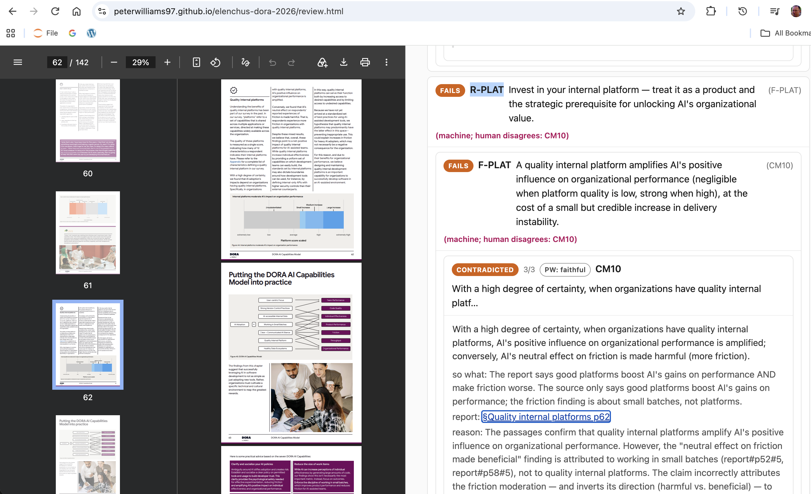

# elenchus

Reports are written to persuade.

[`assay`](assay.go) reads a report against the documents it draws on and asks, claim by claim, 
whether the sources actually bear each one out. Then propagates those checks up through the findings 
and recommendations to the report's thesis. The output is a page that leaves a reader a manageable 
number of claims worth questioning, each with the passage that settles it.



The worked run above is the 2025 DORA *State of AI-assisted Software Development* report (v.2025.2),
checked against its own figures and text: <https://peterwilliams97.github.io/elenchus-dora-2026/>.
It is two panes. 

* The **left** shows the source, in this case the report itself, open at p62 
(*Quality internal platforms*, Figure 44). 
* The **right** is assay's top-down reading: the report's root thesis,
each recommendation under it with a derived verdict, each recommendation opening to the findings it
rests on, and each finding opening to the atomic claims that support it.

In the screenshot the platform recommendation **R-PLAT fails** because its finding **F-PLAT fails**.
F-PLAT fails because its core premise **CM10 is contradicted, 3/3**. The **so what** line
explains the discrepancy: the report attributes friction to platforms, while the original source 
attributes it to small batches. 
The **report: §Quality internal platforms p62** link jumps the left pane to that page; 
the **reason** line is the judge's justification; and the quoted passage beneath it is the report 
text the verdict was read against. Click a report `§` or a quote on the right and the left
pane jumps to that page of that PDF.


The top of the right pane has the thesis, the tally over the nine recommendations, and the
recommendations themselves (`examples/dora-2026/site/index.html`, contents from
`examples/dora-2026/argument.txt`):

```
AI's primary role in software development is that of an amplifier — it magnifies the strengths of
high-performing organizations and the dysfunctions of struggling ones; the greatest returns come not
from the tools themselves but from the underlying organizational system.

Of 9 recommendations, 3 hold (R-DATA, R-BATCH, R-USER), 3 are weakened (R-STANCE, R-ACCESS, R-VSM),
2 fail (R-VC: no held source supports F-VC, R-PLAT: no held source supports F-PLAT), 1 is opinion
(R-TRANSFORM ?).
2 findings support no recommendation.

weakened  R-STANCE       Clarify and socialize your AI policies — establish a clear, communicated policy on permitted tools and usage.
holds     R-DATA         Treat your data as a strategic asset — invest in the quality, accessibility, and unification of internal data sources.
weakened  R-ACCESS       Connect AI to your internal context — give AI tools secure access to internal documentation, codebases, and data.
fails     R-VC           Embrace and fortify your safety nets — make teams proficient in rollback and revert features.
holds     R-BATCH        Reduce the size of work items — enforce the discipline of working in small batches.
holds     R-USER         Center users' needs in product strategy — keep the user as the product's North Star.
fails     R-PLAT         Invest in your internal platform — treat it as a product and the strategic prerequisite for unlocking AI's organizational value.
weakened  R-VSM          Use value stream management to turn AI investment into a competitive advantage.
opinion   R-TRANSFORM ?  Treat AI adoption as an organizational transformation, not a tools purchase — redesign workflows, roles, governance, and culture.
```

## Worked examples

- <https://peterwilliams97.github.io/elenchus-dora-2026/> — the 2025 DORA *State of AI-assisted
  Software Development* report (v.2025.2), its headline findings checked against the report's own
  data, with the human adjudications shown beside the machine verdicts.
- <https://peterwilliams97.github.io/elenchus-vic-lceic/> — the Victorian LCEIC inquiry into the
  cultural and creative industries, checked claim-by-claim against the hearing transcripts and
  submissions. Run the same corpus twice and about 20% of leaf verdicts move (of 60 judged findings:
  48 settle, 3 wobble, 9 contested); a leaf that moves is marked contested and sent to the reader.

## How to read the right pane

Every node — the root, each recommendation, each finding — carries a **derived** verdict. The six
node labels, from `spec/ARGUMENT.md`:

- **holds** — every load-bearing child holds. The node stands on the ground its content claims.
- **weakened** — no child fails or opens, but some child is only partial, or wobbles between runs.
  The node still stands, but on narrower ground than its content claims.
- **open** — no load-bearing child fails, but the report never states what the node rests on (a `?`
  edge, or no finding attached), or a finding it rests on is contested. Not settled either way — the
  reader has to open it.
- **fails** — a load-bearing child fails: a supporting claim is contradicted, unsupported, or absent
  from the sources. One collapsed load-bearing premise collapses the node.
- **opinion** — the node is a pure value judgement. That is not evidence, so faithfulness cannot
  settle it and the tree does not pretend to.
- **contested** — a leaf where two identical runs land on different verdicts because the sources
  don't settle the claim either way.

**open** and **contested** are facts about the report, not about assay: **open** marks a place where
the report never says what its recommendation rests on, and **contested** marks a claim the sources
leave underdetermined — both describe the material, not the tool that read it.

Under every finding sit its atomic claims, each with a **leaf faithfulness verdict** — whether the
source bears the claim out, never whether it is true (`spec/ARGUMENT.md`, `spec/TREE.md`):

- **faithful** — the source states the claim's subject, scope, and direction.
- **partial** — the source is adjacent, narrower, or broader: it bears on the claim without stating
  it (a scope, denominator, timerange, or attribution gap).
- **overstated** — the claim inflates the source: a hedge dropped, a number pushed, a certainty the
  source does not carry.
- **absent** — the cited document is held and was searched, but says nothing on the claim.
- **contradicted** — the source states the opposite of the claim.

(Two more the vocabulary carries: **unsupported** — no held source states it — and **unverifiable** —
the cited document is not in the corpus.)

Three more things ride on a leaf:

- **3/3** — the agreement. Each claim is judged N times (here N=3); `k/N` is how many of those
  samples landed on the verdict shown. `3/3` is unanimous; a split such as `2/3` is a claim the judge
  itself was unsure of.
- **so what** — one line, in plain words, naming the gap between what the report says and what the
  source says (`The report says X; the source only says Y`). It is the leaf's headline for a reader
  deciding whether to look closer.
- **reason** — the judge's own one-line justification for the verdict, citing the passages it read.

## Where the judgements come from

Three inputs, kept separate on purpose:

- The **report** supplies the propositions and the structure — each node's content, in the report's
  own words, and which findings a recommendation rests on.
- The **sources** supply the quotes each claim is checked against, carrying the document and page
  each came from.
- The **code** derives every verdict. No judgement is written by hand; each is computed from the
  leaves up (`spec/ARGUMENT.md`). Writing a verdict into the tree is the one edit the format forbids —
  it would let the builder's opinion pass as a result.

What counts as a source differs by run. For **DORA** the corpus holds exactly one document — the
report itself — so the only automated check is internal consistency: does the report say this, and do
its figures agree across chapters and pages? It does not ground the survey numbers; their truth-maker
is the survey microdata and the fitted models, which are not held, so every survey figure comes back
`unverifiable` for grounding by design, not omission (`examples/dora-2026/sources/MANIFEST.md`). For
**LCEIC** the sources are external — the hearing transcripts, submissions, and questions-on-notice,
each quote carrying its document, witness, and page — so a claim is checked against a document other
than the one making it.

On both runs, machine verdicts a human has read are shown beside the machine badge with the
reviewer's initials, and the argument page reports how many adjudicated leaves the judge agreed on
(for DORA, 4 of 10) (`spec/SERVE.md` § Adjudications).

## Run it on your own report

You supply four things:

- **claims** — the report's atomic claims, one file (`claims.txt`), plus `claims-machine.txt` mapping
  each claim to its report section.
- **argument** — the tree structure: root → recommendations → findings → claims, content only, no
  verdicts (`argument.txt`).
- **manifest** — `sources/MANIFEST.md`, mapping each source document's id to its file, witness, and
  locator.
- **sources** — the source documents themselves (`sources/hearings`, `sources/submissions`,
  `sources/qon`, `report.pdf`).

A faithfulness run (the model judge pass) produces the chain (`*.faithfulness.jsonl`) — this is
the model pass, roughly **$8 per run**. Everything below makes no model calls. The exact commands
(from [`examples/vic-lceic/current/PROVENANCE.md`](examples/vic-lceic/current/PROVENANCE.md), run
from that directory):

```sh
# Merge two grounding runs leaf-by-leaf (majority verdict) and render the report tree.
assay -from current.faithfulness.jsonl,current-2026-09-10.faithfulness.jsonl claims.txt -tree

# Render the argument tree, add per-leaf quote provenance, and write review.html.
assay -from current.faithfulness.jsonl,current-2026-09-10.faithfulness.jsonl \
  -argument ../argument.txt -manifest ../sources/MANIFEST.md -refs ../claims-machine.txt \
  -review \
  claims.txt

# One-off: attach each quote's passage id so provenance resolves (no model call).
assay -backfill-passages <chain> -source ../sources/hearings,../sources/submissions,../sources/qon
```

`-review` needs `-argument` and `-manifest`; it writes `review.html` alongside `index.html`, with
the report `§` and quote links rewritten to open the source PDFs in the left pane. `assay serve
<site-dir>` then serves the built site over HTTP so the `#page=N` links land on the right page.

## For readers

The narrative walkthrough of the LCEIC run is a Google Doc:
<https://docs.google.com/document/d/1GekNT4G8ESlQ__HrKafCTeaEOi7v2AVHBR3pqevM7HQ>.

## The name

Named for the Socratic *elenchus*: refuting a claim not by asserting its opposite, but by drawing out
what the claimant is committed to and showing where those commitments collide. The
[link](https://plato.stanford.edu/entries/plato-ethics-shorter/) is where the chain of rigour starts;
this repo is an attempt to continue it on modern work artifacts. It keeps three questions apart that
careless reasoning collapses into one: did the source actually say this? Is the claim well-formed?
Is it borne out by evidence? A claim can pass the first two and fail the third.

## Other modes

`assay` began as a single-document dialectical filter, and those modes still ship. Each runs one file
rather than a report tree; build with `./build.sh`, `ANTHROPIC_API_KEY` required.

- **Substance** (default) — `./assay memo.txt`. Decomposes the prose into atomic claims and runs a
  producer–critic dialectic on each: a Producer steelmans the claim blind to the attack, a Critic
  attacks on seven fixed axes (evidence, hidden premise, falsifiability, equivocation, base
  rate / magnitude, counterexample, causality vs correlation). Verdict:
  `substantive` · `partial` · `hollow`.
- **Faithfulness** — `./assay -source transcript.txt summary.txt`. Checks whether each claim in the
  summary is borne out verbatim by the source, never whether it is true. Verdict:
  `faithful` · `partial` · `overstated` · `absent` · `contradicted`.
- **Grounding** — `./assay -evidence claims.txt`. Web-searches for each claim's truth-maker. Verdict:
  `supported` · `mixed` · `refuted` · `unverifiable`. The only mode that touches truth; predictions
  correctly come back `unverifiable`.
- **Audit** — `./assay -audit -source transcript.txt -md summary.txt`. All three at once,
  cross-tabulated; the signal lives where the columns disagree.

Full flag list, design rationale, and the failure envelope are in `BACKGROUND.md` and `TESTING.md`.
